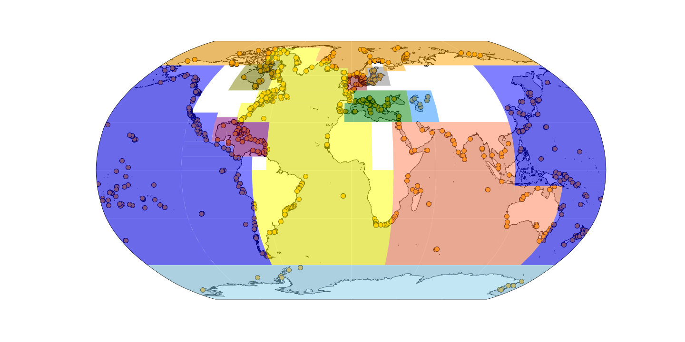

# A radiocarbon calibration notebook

This notebook uses the [IOSACal](https://iosacal.readthedocs.io/en/latest/index.html) open source radiocarbon calibration software to calibrate HOLSEA notebooks. 

## Contents
* calibrateAges_toshare.ipynb -- a notebook for calibrating radiocarbon ages
* delta_R_calibration.xlsx -- an excel file with marine reservoir ages taken from Calib
* environment.yml -- a file to build a conda environment
* HOLSEA_2020_Singapore.xlsx -- the HOLSEA formatted data file from Chua et al. 2020
* IOSA_v_Calib_Terrestrial.xlsx -- comparison of Iosacal, calib, oxcal, and bchron.  Lat/lons are randomly generated in order to test marine reservoir correction.
* Makefile -- a file to ease conda environment installation
* License 

## To run, please follow these instructions:

1. download the directory
2. Navigate into directory on command line
3. Download anaconda if you don't already have it (e.g. ```brew install anaconda```)
4. type ```make install``` to install custom conda environment 
5. activate conda environment: ```conda activate c14```
6. open jupyter lab ```jupyter lab```
7. Run jupyter notebook.

## Features

This notebook is configured to accept a HOLSEA-style excel spreadsheet and save a new excel file to your path of choice.  The Iosacal user guide is regrettably uninformative; if you have questions about the calibration details I suggest either reading the [source code](https://codeberg.org/steko/iosacal/src/branch/main) or emailing me at <rcc2167@columbia.edu>.

I have built a few exceptions/error catchers into the code, and plan to add more.  Please email me if it breaks and we can fix it. 

N.B. the code calculates reservoir age & uncertainty based either on the closest n reservoir ages, all reservoir ages within x km (great circle distance), or a combination.  Data are organized into regions based roughly on ocean circulation patterns: 



&Delta;R values are taken from [14CHRONO Marine20 Reservoir database](http://calib.org/marine/) 


